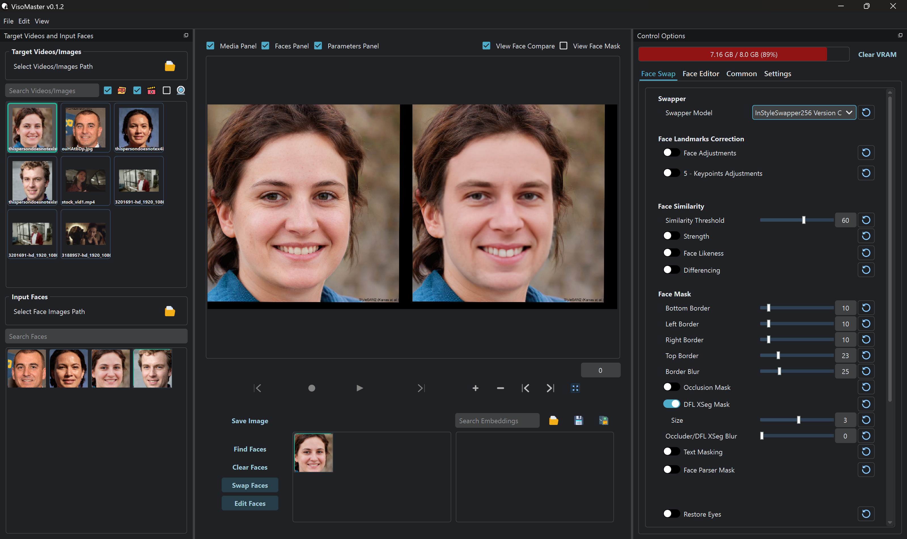

# VisoMaster 
### VisoMaster is a powerful yet easy-to-use tool for face swapping and editing in images and videos. It utilizes AI to produce natural-looking results with minimal effort, making it ideal for both casual users and professionals.  

---


## Features  

### 🔄 **Face Swap**  
- Supports multiple face swapper models  
- Compatible with DeepFaceLab trained models (DFM)  
- Advanced multi-face swapping with masking options for each facial part  
- Occlusion masking support (DFL XSeg Masking)  
- Works with all popular face detectors & landmark detectors  
- Expression Restorer: Transfers original expressions to the swapped face  
- Face Restoration: Supports all popular upscaling & enhancement models  

### 🎭 **Face Editor (LivePortrait Models)**  
- Manually adjust expressions and poses for different face parts  
- Fine-tune colors for Face, Hair, Eyebrows, and Lips using RGB adjustments  

### 🚀 **Other Powerful Features**  
- **Live Playback**: See processed video in real-time before saving  
- **Face Embeddings**: Use multiple source faces for better accuracy & similarity  
- **Live Swapping via Webcam**: Stream to virtual camera for Twitch, YouTube, Zoom, etc.  
- **User-Friendly Interface**: Intuitive and easy to use  
- **Video Markers**: Adjust settings per frame for precise results  
- **TensorRT Support**: Leverages supported GPUs for ultra-fast processing  
- **Many More Advanced Features** 🎉  

## Automatic Installation (Windows)
- For Windows users with an Nvidia GPU, we provide an automatic installer for easy set up. 
- You can get the installer from the [releases](https://github.com/visomaster/VisoMaster/releases/tag/v0.1.1) page or from this [link](https://github.com/visomaster/VisoMaster/releases/download/v0.1.1/VisoMaster_Setup.exe).
- Choose the correct CUDA version inside the installer based on your GPU Compatibility.
- After successful installation, go to your installed directory and run the **Start_Portable.bat** file to launch **VisoMaster**

## **Manual Installation Guide (Nvidia)**

Follow the steps below to install and run **VisoMaster** on your system.

## **Prerequisites**
Before proceeding, ensure you have the following installed on your system:
- **Git** ([Download](https://git-scm.com/downloads))
- **Miniconda** ([Download](https://www.anaconda.com/download))

---

## **Installation Steps**

### **1. Clone the Repository**  
Open a terminal or command prompt and run:  
```sh
git clone https://github.com/visomaster/VisoMaster.git
```
```sh
cd VisoMaster
```

### **2. Create and Activate a Conda Environment**  
```sh
conda create -n visomaster python=3.10.13 -y
```
```sh
conda activate visomaster
```

### **3. Install CUDA and cuDNN**  
```sh
conda install -c nvidia/label/cuda-12.4.1 cuda-runtime
```
```sh
conda install -c conda-forge cudnn
```

### **4. Install Additional Dependencies**  
```sh
conda install scikit-image
```
```sh
pip install -r requirements_cu124.txt
```

### **5. Download Models and Other Dependencies**  
1. Download all the required models
```sh
python download_models.py
```
2. Download all the files from this [page](https://github.com/visomaster/visomaster-assets/releases/tag/v0.1.0_dp) and copy it to the ***dependencies/*** folder.

  **Note**: You do not need to download the Source code (zip) and Source code (tar.gz) files 
### **6. Run the Application**  
Once everything is set up, start the application by opening the **Start.bat** file.
On Linux just run `python main.py`.
---

## **Troubleshooting**
- If you face CUDA-related issues, ensure your GPU drivers are up to date.
- For missing models, double-check that all models are placed in the correct directories.

## [Join Discord](https://discord.gg/5rx4SQuDbp)

## Support The Project ##
This project was made possible by the combined efforts of **[@argenspin](https://github.com/argenspin)** and **[@Alucard24](https://github.com/alucard24)** with the support of countless other members in our Discord community. If you wish to support us for the continued development of **Visomaster**, you can donate to either of us (or Both if you're double Awesome :smiley: )

### **argenspin** ###
- [BuyMeACoffee](https://buymeacoffee.com/argenspin)
- BTC: bc1qe8y7z0lkjsw6ssnlyzsncw0f4swjgh58j9vrqm84gw2nscgvvs5s4fts8g
- ETH: 0x967a442FBd13617DE8d5fDC75234b2052122156B
### **Alucard24** ###
- [BuyMeACoffee](https://buymeacoffee.com/alucard_24)
- [PayPal](https://www.paypal.com/donate/?business=XJX2E5ZTMZUSQ&no_recurring=0&item_name=Support+us+with+a+donation!+Your+contribution+helps+us+continue+improving+and+providing+quality+content.+Thank+you!&currency_code=EUR)
- BTC: 15ny8vV3ChYsEuDta6VG3aKdT6Ra7duRAc


## Disclaimer: ##
**VisoMaster** is a hobby project that we are making available to the community as a thank you to all of the contributors ahead of us.
We've copied the disclaimer from [Swap-Mukham](https://github.com/harisreedhar/Swap-Mukham) here since it is well-written and applies 100% to this repo.
 
We would like to emphasize that our swapping software is intended for responsible and ethical use only. We must stress that users are solely responsible for their actions when using our software.

Intended Usage: This software is designed to assist users in creating realistic and entertaining content, such as movies, visual effects, virtual reality experiences, and other creative applications. We encourage users to explore these possibilities within the boundaries of legality, ethical considerations, and respect for others' privacy.

Ethical Guidelines: Users are expected to adhere to a set of ethical guidelines when using our software. These guidelines include, but are not limited to:

Not creating or sharing content that could harm, defame, or harass individuals. Obtaining proper consent and permissions from individuals featured in the content before using their likeness. Avoiding the use of this technology for deceptive purposes, including misinformation or malicious intent. Respecting and abiding by applicable laws, regulations, and copyright restrictions.

Privacy and Consent: Users are responsible for ensuring that they have the necessary permissions and consents from individuals whose likeness they intend to use in their creations. We strongly discourage the creation of content without explicit consent, particularly if it involves non-consensual or private content. It is essential to respect the privacy and dignity of all individuals involved.

Legal Considerations: Users must understand and comply with all relevant local, regional, and international laws pertaining to this technology. This includes laws related to privacy, defamation, intellectual property rights, and other relevant legislation. Users should consult legal professionals if they have any doubts regarding the legal implications of their creations.

Liability and Responsibility: We, as the creators and providers of the deep fake software, cannot be held responsible for the actions or consequences resulting from the usage of our software. Users assume full liability and responsibility for any misuse, unintended effects, or abusive behavior associated with the content they create.

By using this software, users acknowledge that they have read, understood, and agreed to abide by the above guidelines and disclaimers. We strongly encourage users to approach this technology with caution, integrity, and respect for the well-being and rights of others.

Remember, technology should be used to empower and inspire, not to harm or deceive. Let's strive for ethical and responsible use of deep fake technology for the betterment of society.
